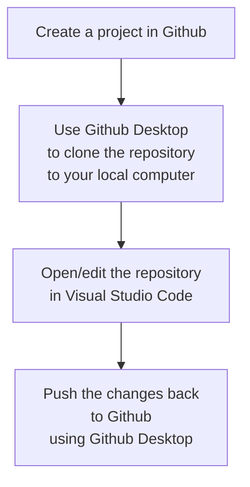
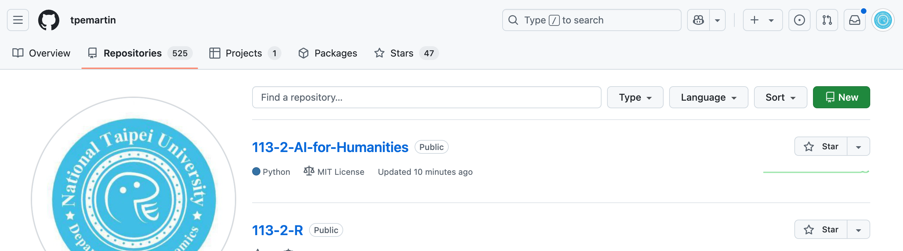
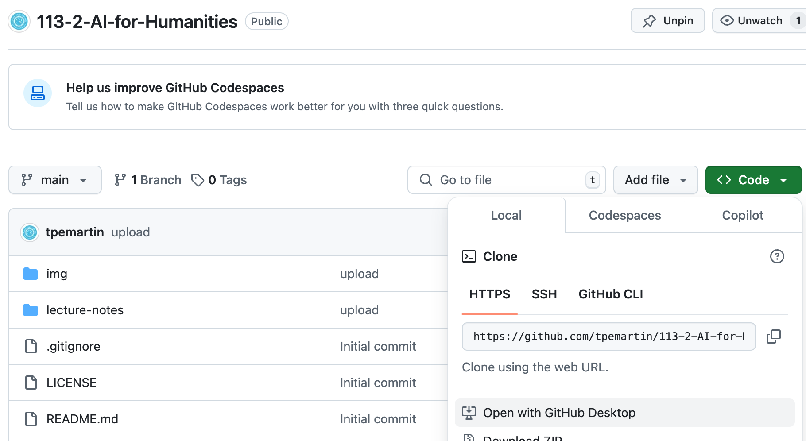
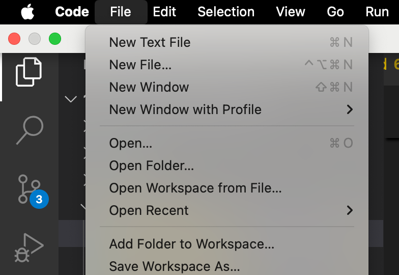
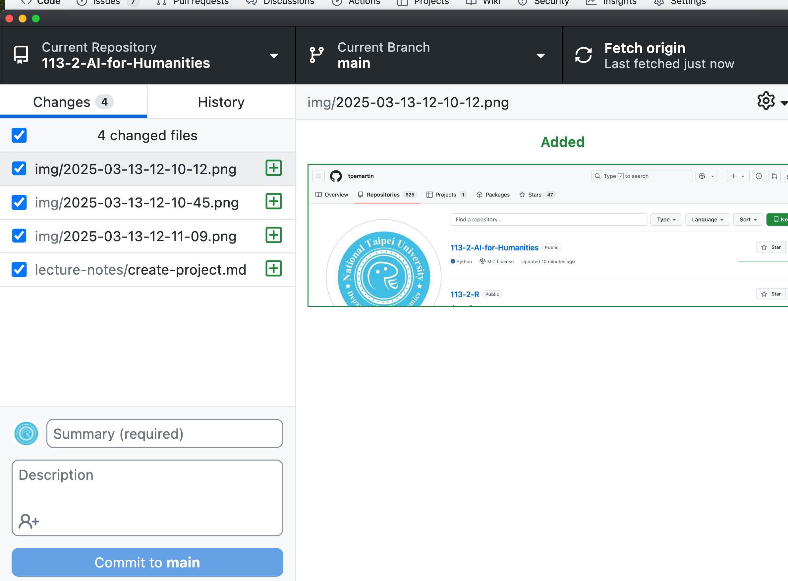

# Create project

```mermaid
graph TD
    A["Create a project in Github"]
    B["Use Github Desktop 
    to clone the repository 
    to your local computer"]
    C["Open/edit the repository
     in Visual Studio Code"]
    D["Push the changes back 
    to Github 
    using Github Desktop"]

    A --> B
    B --> C
    C --> D
```

## Create a repository on Github

## Clone the repository to your local computer

## Open and edit the repository in Visual Studio Code

## Push the changes back to Github

