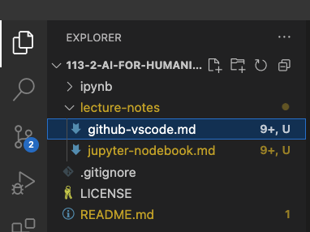
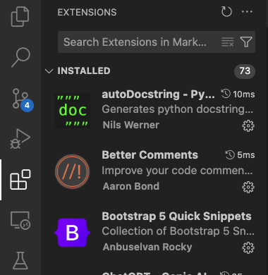

# Visual Studio Code 101

## Explorer

  - create new file
      - `.md` - markdown
      - `.py` - python
      - `.ipynb` - jupyter notebook
      - `.R` - R
  - create new folder

## Extension

